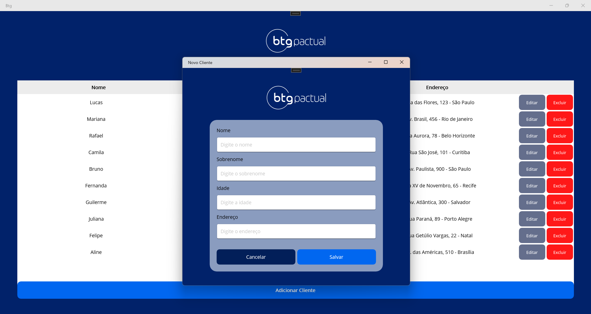

# 📋 Cadastro de Clientes (.NET MAUI - Windows)

Este projeto foi desenvolvido como parte do processo seletivo técnico do **BTG Pactual**. A aplicação é um **cadastro de clientes** que permite realizar **inclusão, edição, exclusão e listagem** de forma simples, funcional e moderna, utilizando **.NET MAUI** com **MVVM**, voltado exclusivamente para **plataforma Windows**.

---

## 🎯 Requisitos Atendidos

| Requisito                                         | Atendido |
|---------------------------------------------------|----------|
| Projeto MAUI exclusivo para Windows               |    ✅    |
| Implementação completa do padrão MVVM             |    ✅    |
| Cadastro com campos: Name, Lastname, Age, Address |    ✅    |
| Tela inicial com lista de clientes                |    ✅    |
| Inclusão, edição e exclusão de clientes           |    ✅    |
| Ações de inclusão/edição em nova janela           |    ✅    |
| Janela centrada e maximizada                      |    ✅    |
| Cancelar ou salvar fecha a janela                 |    ✅    |
| Exclusão com confirmação                          |    ✅    |
| Injeção de dependência (DI)                       |    ✅    |
| Validação de entrada (ex: idade numérica)         |    ✅    |
| Dados apenas em memória                           |    ✅    |
| Repositório público no GitHub                     |    ✅    |

---

## 🧱 Tecnologias Utilizadas

- .NET MAUI (v9.0)
- C# 12
- MVVM (Model-View-ViewModel)
- CommunityToolkit.Mvvm
- Injeção de dependência via `MauiProgram.cs`
- Mensageria fraca com `WeakReferenceMessenger`
- Manipulação de janelas com `AppWindow` (Windows)

---

## 📦 Funcionalidades

- **✅ Listagem** de clientes com visual limpo e organizado.
- **➕ Inclusão** de novo cliente.
- **✏️ Edição** do cliente existente com validação.
- **❌ Exclusão** com alerta de confirmação.
- **📋 Validação** de todos os campos.
- **🪟 Janela Modal** para inclusão/edição, centralizada e com suporte a fechamento controlado via ViewModel.

---

## 🖼️ Print da Aplicação

